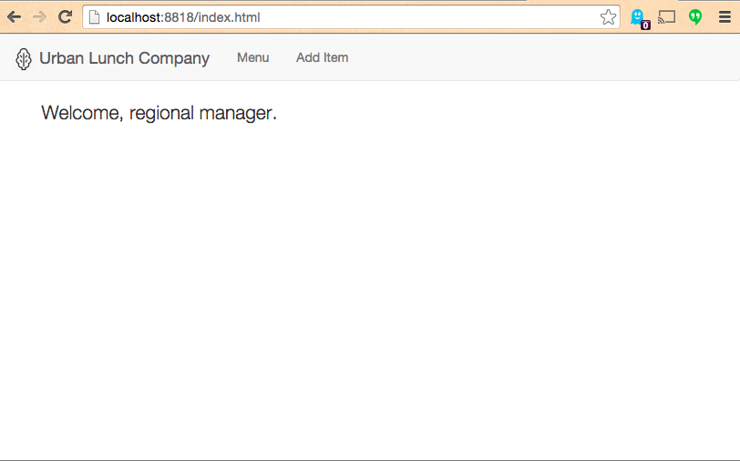
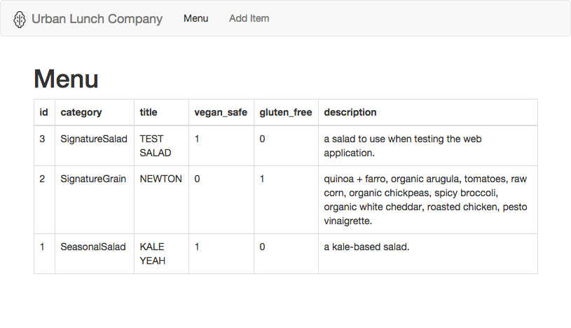
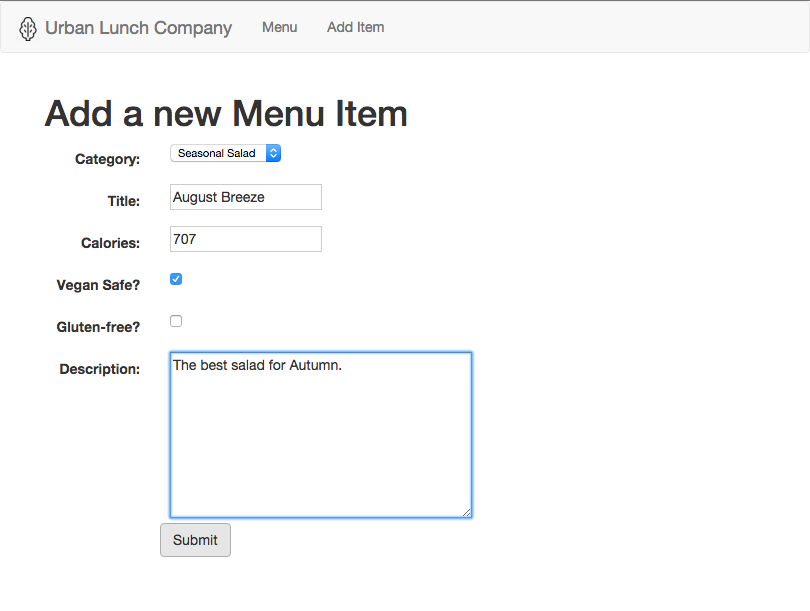
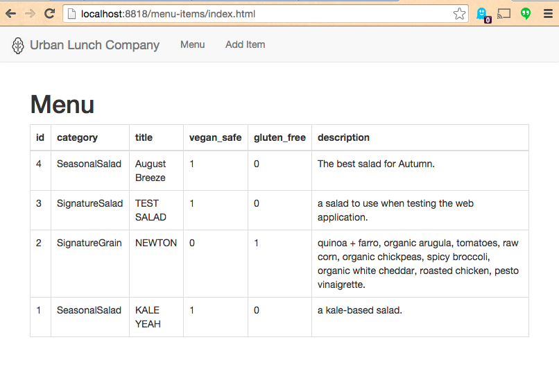

# Salad System (Python)

An example database-connected web application,
 with server-side software written in Python. Represents a partial implementation of [Salad System Requirements](https://github.com/gwu-business/salad-system-requirements).

Features:

 + Populates the database with menu data.
 + Stores in the database information captured from a web form.
 + Produces menu page using data from the database.









## Usage

Download the repository.

```` sh
git clone git@github.com:gwu-business/salad-system-py.git
cd salad-system-py
````

Create a new local database
 and populate it with menu data (requires mysql).

```` sh
# if your root user does not have a password: run these commands without the -p flag, or press enter when prompted for a password ...
cat database/create.sql | mysql -u root -p
mysql -uroot -p salad_db < database/migrate.sql
mysql -uroot -p salad_db < database/populate.sql
````

Install python package dependencies (requires python and pip).

```` sh
pip install -r software/requirements.txt
````

Create another menu item record, this time using a python script.

```` sh
python software/add_menu_item.py
````

Start a local web server.

```` sh
python software/start_local_web_server.py
````

Visit [localhost:8818](localhost:8818) in a browser
  to view the menu
  and create new menu items.

## Contributing

[Issues](https://github.com/gwu-business/salad-system-py/issues) and [Pull Requests](https://github.com/gwu-business/salad-system-py/pulls) welcome.

## [License](LICENSE.md)
